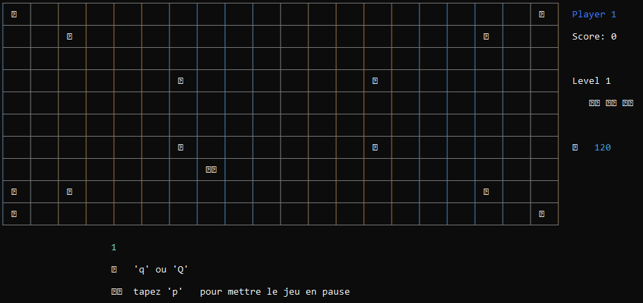

# Data Engineer & ML Engineer

## About
I am an engineering student in computer engineering, Big Data, and Cloud Computing at ENSET Mohammedia, and my training covers areas such as Software Engineering, Distributed systems, DevOps, Cloud Computing, Artificial Intelligence, and Data Engineering.
## Education
- State Engineering., Computer Engineering, Big Data Cloud Computing | ENSET Mohammedia , University Hassan 2
  ( september 2023- July 2026)
- DEUST., Mathematics Physics and Computer Science | FST Settat, University Hassan 1 (October 2021 - july 2023)

### Technical Skills
- **Programming languages** : C, C++, Python, Java, Javascript, SQL, Bash
- **Databases** : MySQL, NoSQL (Cassandra, MongoDB,Redis)
- **Backend Technologies** : Node.js, Flask, REST API
- **Virtualization** : Docker, Kubernetes, Vsphere
- **AI** : Scikt-learn, Tensorflow.
- **Others** : Git, UML, Linux, Networking
- **Oracle Cloud Fondations Associate**

## Projects
### [EduChatBot](https://github.com/YoussoufHard/chatbotEdu.git)
**Description**
ChatbotEdu is an innovative educational application designed to provide relevant and contextualized answers to students at ENSET. This project uses a RAG architecture to combine a pre-trained model (Gemini) with enriched documentary data from the ENSET educational database. The application also supports multimodal features, allowing interactions through text, documents, and images.

**Skills**
- Frontend : JavaFX friendly GUI 
- Backend (Flask or FastAPI): Interactions with the chatbot.
- Database (MySQL/PostgreSQL): Ressources storage.
- Search Engine (FAISS): Fast and accurate search for relevant documents.
- Multimodal Engine (CLIP / Gemini Vision): Analysis and processing of image-based queries.

### [Learning-platform-nosql](https://github.com/Believer2001/learning-platform-nosql)

**Description**

This project is   a create of  small API to serve as the backend for an online learning platform. We are using the Node.js framework for the backend with the Express library. Our backend application will handle communication with a MongoDB database to provide responses to requests. To improve the speed and fluidity of the application, we've implemented a caching mechanism managed by Redis.

**Skills**
- MongoDB and Redis
- Cache Management
- Bakend  management (Node.js ,express and Javascript)
  

### [*Bash Scriting : WIFI Management*](https://github.com/Believer2001/Bash_Script_WIFI_Management.git)

**Description**

This project aims to address the challenges of efficient network connection management, particularly Wi-Fi, on Unix/Linux systems. The script provides a user-friendly interface to list available networks, connect to a specific Network, and save/restore network configurations. It also enhances security by prompting for passwords when connecting to secure networks it ensures system reliability and robustness by effectively managing errors and exceptions in various usage scenarios.

**Skills**
- Web Scrapping with (Beautifulsoup, Selenium)
- bash scipting
- Linux command

### [School Management System](https://github.com/Believer2001/SchoolmanagementSystem)

**Description**

The school management System project is an academic project that allows for the management of a school for better satisfaction. The System enables registration and tracking of various activities of the establishment, including enrollment, courses, and student evaluations, which are stored in a database. This project highlights frontend skills and provides an understanding of backend functionality, including SQL queries and PHP. 

**Skills**

- Relationnal Database Modeling (UML)
- SQL query Language and MySQL RDMS
- PHP for the backend.
- Frontend basics technologies (HTML,CSS, Javascript, Bootstraap)
  

### [Tetris Gaming](https://github.com/Believer2001/Tetrise-Project)

**Description**

The Tretis project is an educational video game project that applies knowledge of data structures, particularly linked lists, in C++ with an object-oriented paradigm.The game has been developed in console mode and features a graphical interface using the SDL library in C.

**Skills**

- Data Structure(Linked lists,queue,Stack,File)
- C++ Programming
- Object-oriented paradigm
- SDL Library for the GUI

###  [Snoopy Gaming](https://github.com/Believer2001/snoopy)

**Description**

The Snopy video game project is video game project developed solely in Command Line interface mode using the C language. It features the main character Snopy, who attempts to rescue hostages in real-time while also facing obstacles throughout the journey

**Skills**

- Advanced C  programing and Best Patices
- Algorithmiic 

